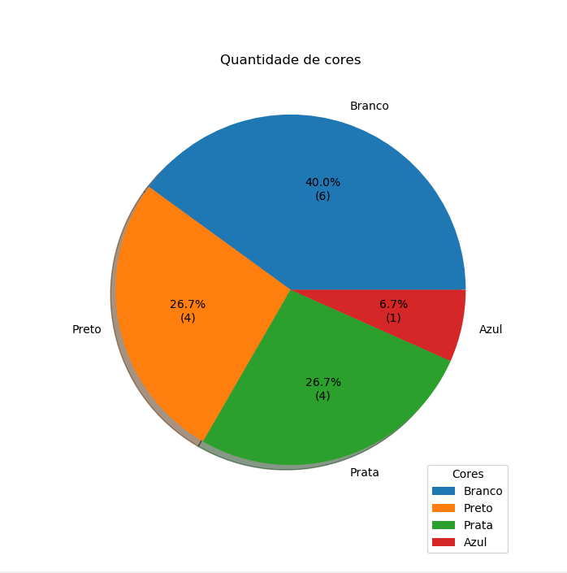

# Projeto-Monitoria-IP

```shell
>> Projeto para a avaliação de candidatos à monitoria da disciplina IF-669
```

<p align="center">
    <image src="./static/dual-grafico.png">
</p>

Ler arquivos (bem desorganizados) de modo a produzir gráficos

<p align = 'center'>
    <image width = 100% src="./static/dataframe.png"/> 
</p>


> Foi permitido ser pythonic
>
> Pediu pra usar orientação a objeto, então exagerei



## Main
Onde o programa realmente vai rodar, printando as formas dos objetos e plotando os gráficos.

## Objeto leitor
Faz a leitura de todos os arquivos em encoding UTF-8 (por causa do windows)


## Objeto carro
Condiciona todas as informações em objetos, filtrando os resultados do objeto anterior

<image align="left" width='60%' src="./static/grafico01.png"/> 

## Objeto grafico
Recebe os dados e transforma em um gráfico

### Java
Só uma brincadeira, pra descontrair, para lembrar Java (que era a linguagem usada anteiormente na disciplina)

### Filtragem
<image src="./static/formato.png"/> 